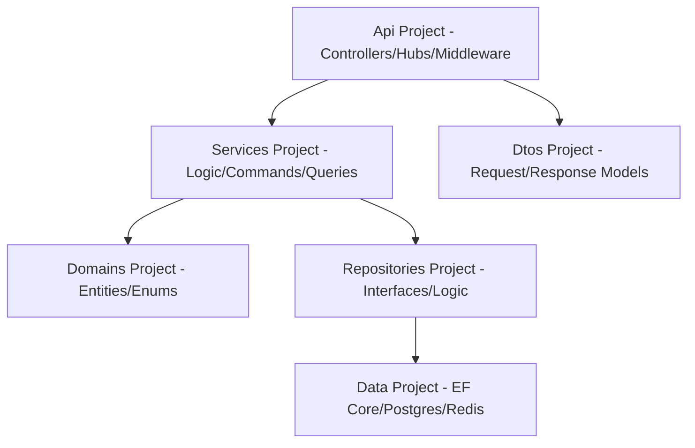

# Documentação Técnica: Backend web_ifood 🚀

Esta documentação detalha minuciosamente a arquitetura, os módulos, as rotas, os modelos de dados e as regras de negócio do backend da plataforma **web_ifood**.

---

## 1. Visão Geral e Stack Técnica

O backend foi construído seguindo os princípios da **Clean Architecture** e **CQRS**, garantindo alta escalabilidade e facilidade de manutenção.

- **Framework:** .NET 8 (Web API)
- **Banco de Dados Relacional:** PostgreSQL (EF Core)
- **Cache e Dados Voláteis:** Redis (StackExchange.Redis)
- **Comunicação em Tempo Real:** SignalR (WebSockets)
- **Mensagens e Jobs:** Hangfire
- **Observabilidade:** OpenTelemetry + Serilog
- **Resiliência:** Polly (Retry & Circuit Breaker)
- **Documentação:** Swagger/OpenAPI

---

## 2. Arquitetura de Software

---

## 3. Módulos e Funcionalidades

### 🔐 Autenticação e Segurança
Implementa fluxo JWT com suporte a Autenticação de Dois Fatores (OTP).
- **Rate Limiting:** Máximo de 60 requisições por minuto por IP/Usuário (Redis).
- **Detecção de Fraude:** Monitoramento de uso de cartões múltiplos em janelas de tempo curtas.
- **Headers de Segurança:** HSTS, X-XSS-Protection, X-Frame-Options ativados.

### 🍱 Catálogo e Restaurantes
Geolocalização agressiva para busca de lojas.
- **Busca Geográfica:** Utiliza Redis Geospatial (`GEOADD`/`GEORADIUS`) + Haversine Formula para precisão de entrega.
- **Gestão de Cardápio:** Controle de disponibilidade, preços promocionais e categorias.

### 🛒 Carrinho e Pedidos
Padrão **Cache-Aside** para performance extrema.
- **Carrinho:** Persistido em Redis para baixa latência entre transições de página no Front-end.
- **Checkout:** Motor complexo que valida cupons, calcula taxas de entrega dinâmicas e reservas de estoque.

### 💰 Financeiro e Repasses
- **Statements:** Registro contábil de cada transação (Créditos para lojas, Débitos de comissão).
- **BalanceService:** Cálculo automático de saldo para saque semanal/mensal dos parceiros.

### 📡 Real-time e Logística
- **Rastreio de Entregadores:** Atualização GPS a cada 30s broadcasted via SignalR para o cliente.
- **Nearby Dispatch:** Alocação automática de entregador num raio de 2km baseado na carga de trabalho atual.
- **Chat:** Mensageria instantânea entre as partes do pedido com persistência de histórico.

---

## 4. Referência de API (Endpoints)

### 🔑 Autenticação (`/api/Auth`)
| Método | Rota | Descrição | Corpo da Requisição (JSON) | Retorno (Sucesso) |
| :--- | :--- | :--- | :--- | :--- |
| `POST` | `/login` | Autentica usuário | `{ Email, Password }` | `JWT Token + UserData` |
| `POST` | `/otp/send` | Envia código OTP | `{ Email, Type }` | `200 OK` |
| `POST` | `/otp/verify` | Valida código | `{ Email, Code, Type }` | `200 OK` |

### 👤 Perfil e Privacidade (`/api/Profile`) — [Authorize]
| Método | Rota | Descrição | Observação |
| :--- | :--- | :--- | :--- |
| `GET` | `/me` | Dados do usuário logado | Baseado em Claims do Token |
| `PUT` | `/me` | Atualiza Nome/Telefone | Limite de 1 alteração por 24h |
| `DELETE` | `/me` | Direito ao esquecimento | Anonimiza todos os dados sensíveis |
| `GET` | `/export` | Exportação de dados | Gera JSON consolidado para o usuário |
| `GET` | `/addresses` | Lista endereços salvos | |

### 🍴 Restaurantes e Cardápio (`/api/Restaurant` & `/api/store/menu`)
| Método | Rota | Descrição | Query Params / Body |
| :--- | :--- | :--- | :--- |
| `GET` | `/search` | Busca por geolocalização | `lat, lng, radius` |
| `GET` | `/menu/{restaurantId}` | Menu público | Retorno cacheado |
| `POST` | `/menu` | **[Partner]** Add Produto | `{ Name, Price, Description, Category, ImageUrl }` |
| `PATCH` | `/menu/{id}/availability` | **[Partner]** On/Off | Altera visibilidade no app |

### 📦 Pedidos e Carrinho (`/api/Cart` & `/api/Order`) — [Authorize]
| Método | Rota | Descrição | Detalhes |
| :--- | :--- | :--- | :--- |
| `POST` | `/Cart/items` | Adiciona item ao carrinho | Substitui restaurante se for diferente |
| `POST` | `/Order` | **Checkout** | Valida Cupom e Taxa de Entrega |
| `POST` | `/Order/{id}/pay/pix` | Gera QR Code Pix | Integração Mockada de Pagamento |
| `POST` | `/Review` | Avalia pedido entregue | Estrelas (1-5) e Comentários |

### 💬 Chat Interno (`/api/Chat`) — [Authorize]
| Método | Rota | Descrição | Regra de Acesso |
| :--- | :--- | :--- | :--- |
| `GET` | `/{orderId}/history` | Lista mensagens | Apenas participantes do pedido |
| `POST` | `/send` | Envia mensagem | Persiste no Banco e emite via Socket |

### 🎥 SignalR Hubs (WebSockets)
- `/hubs/order`: Eventos de status do pedido (`Confirmed`, `Ready`, `Delivered`).
- `/hubs/chat`: Mensagens instantâneas.
- `/hubs/courier`: Coordenadas geográficas (`UpdateLocation`).

---

## 5. Regras de Negócio Críticas

### 🎟️ Validação de Cupons
O `CouponValidator` aplica rigorosamente as seguintes exclusões:
1. **Primeira Compra:** Cupons marcados como `FirstOrderOnly` falham se o usuário já tiver pedidos concluídos.
2. **Valor Mínimo:** Se o subtotal do carrinho for inferior ao definido no cupom.
3. **Escopo de Restaurante:** Cupons específicos para um restaurante ou categoria.

### 💳 Cálculo de Repasses (Balance)
Após a conclusão (`Delivered`) de um pedido:
- O sistema calcula: `Valor Total - Cupom - Taxa de Comissão (12%) = Saldo Loja`.
- A taxa de entrega é creditada integralmente ao entregador, descontando a taxa de plataforma.

### 🛡️ Resilience & Fault Tolerance
Utilizamos **Polly** no `HttpClient` de serviços externos:
- **Retry:** 3 tentativas com backoff exponencial (2s, 4s, 8s).
- **Circuit Breaker:** Interrompe chamadas se 50% das requisições falharem em 30s, protegendo a API de cascata de erros.

---

## 6. Business Intelligence (BI) e Analytics

### Dashboard Administrativo
- **GMV (Gross Merchandise Value):** Soma de todos os pedidos brutos.
- **Taxa de Conversão:** Pedidos criados vs Pedidos pagos.
- **Top Shops:** Ranking por faturamento e volume.

### Painel do Lojista
- **Vendas por Hora:** Identificação de horários de pico.
- **Churn de Produtos:** Itens mais adicionados ao carrinho vs menos comprados.
- **Relatório Financeiro:** Exportação em `.xlsx` (ClosedXML) para conciliação.

---

## 7. Infraestrutura e Deployment

### Docker (Imagens Alpine)
- **Multi-stage build:** SDK 8.0 para compilação e Runtime 8.0-alpine para execução.
- **Segurança:** Rodando com usuário não-root no container.

### Observabilidade
- **Traces:** Rastreamento completo de requisição entre controllers e repositórios.
- **Logs:** Serilog registrando em JSON para fácil ingestão em ELK/Splunk.

---

*Documento gerado automaticamente pelo sistema de engenharia web_ifood. Última atualização: Março/2026.*
